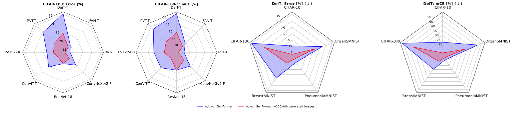

# GenFormer - Generated Images are All You Need to Improve Robustness of Transformers on Small Datasets
[](https://arxiv.org/)
[](#citing) \
Official repository of the ICPR24 paper "GenFormer - Generated Images are All You Need to Improve Robustness of Transformers on Small Datasets" 

[Nikolas Ebert](https://scholar.google.de/citations?user=CfFwm1sAAAAJ&hl=de), Sven Oehri, Ahmed Abdullah, [Didier Stricker](https://scholar.google.de/citations?user=ImhXfxgAAAAJ&hl=de) & [Oliver Wasenmüller](https://scholar.google.de/citations?user=GkHxKY8AAAAJ&hl=de) \
**[CeMOS - Research and Transfer Center](https://www.cemos.hs-mannheim.de/ "CeMOS - Research and Transfer Center"), [University of Applied Sciences Mannheim](https://www.english.hs-mannheim.de/the-university.html "University of Applied Sciences Mannheim")**


<div align="left">

  <div align="center">
    
    <div>&nbsp;</div>
    
  </div>
  <div>&nbsp;</div>


## Get Started

- [Installation](#installation)
- [Main Results and Models](#main-results-and-models)
- [Data preparation](#data-preparation)
- [Evaluation](#evaluation)
- [Training](#training)
- [Data Generation](#data-generation)
- [Acknowledgements](#acknowledgements)
- [Citing](#citing)


## Installation
The code was tested with CUDA 11.8, Python 3.10 PyTorch 2.2.0. The code was not optimized for multi-GPU setups and various models only support 1 GPU.

### Clone this Repo

```
git clone https://github.com/CeMOS-IS/GenFormer
cd genformer
```

### Conda
To set up an Anaconda environment, run the following commands from:
```
conda create -n genformer python=3.10 
conda activate genformer 
pip install torch torchvision torchaudio
pip install -r requirements.txt
pip install -i https://test.pypi.org/simple/ robust-minisets
python3 setup.py develop
```

### Docker 
To build a docker image, run the following  
``` 
docker build -t genformer .
``` 

Adjust visible GPUs, shared memory size and mounted local directory according to your setup, then run the container.: 
```
docker run -it --name genformer --rm \
	--shm-size 100G --gpus '"device=0"' \
	-v /path/to/repo/:/genformer \
	genformer bash
```


## Main Results and Models

<details open><summary>Results and Models on Tiny ImagNet</summary>

| Method  | Train-Strategy | Gen. Images | T-IN Err. | T-INv2 Err. | T-IN-R-Err. | T-IN-C CE | T-IN-A Err. | model |
|---------|----------------|-------------|-----------|-------------|-------------|-----------|-------------|-------|
| DeiT-Ti | Baseline       | False       | 50.3      | 68.0        | 92.5        | 80.6      | 80.6        | [model]() | j
| DeiT-Ti | Baseline       | True        | 44.1      | 65.3        | 89.6        | 77.7      | 78.0        | [model]() | j
| DeiT-Ti | Cutmix + MixUp | False       | 44.4      | 65.0        | 89.7        | 74.5      | 78.3        | [model]() | j
| DeiT-Ti | Cutmix + MixUp | True        | 38.5      | 57.8        | 86.4        | 71.8      | 74.4        | [model]() |
| DeiT-Ti | AugMix         | False       | 40.4      | 61.3        | 88.4        | 72.8      | 76.2        | [model]() | j
| DeiT-Ti | AugMix         | True        | 36.4      | 57.8        | 85.6        | 71.0      | 73.1        | [model]() |
| PVT-T   | Baseline       | False       | 46.5      | 67.2        | 91.5        | 78.9      | 78.9        | [model]() |
| PVT-T   | Baseline       | True        | 42.8      | 64.8        | 87.4        | 76.8      | 77.7        | [model]() |
| PVT-T   | Cutmix + MixUp | False       | 41.9      | 64.6        | 87.8        | 74.1      | 76.8        | [model]() |
| PVT-T   | Cutmix + MixUp | True        | 37.5      | 60.1        | 84.6        | 70.1      | 74.1        | [model]() |
| PVT-T   | AugMix         | False       | 39.9      | 62.1        | 87.9        | 73.0      | 75.9        | [model]() |
| PVT-T   | AugMix         | True        | 36.4      | 58.3        | 86.2        | 71.0      | 73.6        | [model]() |
</details>

<details><summary>Results and Models on CIFAR-10 / CIFAR-100</summary>

| Method   | Gen. Images | C-10 Err. | C-10.1 Err. | C-10-C CE | C-100-C Err | C-100-C CE | model                  |
|----------|-------------|---------------|-----------------|---------------|-----------------|----------------|------------------------|
| ResNet18 | False       | 4.6  j         | 11.2            | 15.1          | 20.5   j         | 37.9           | [model-C10]() / [model-C100]() |
| ResNet18 | True        | 4.1           | 10.1            | 14.6          | 20.3   j         | 38.0           | [model-C10]() / [model-C100]() |
| DeiT-Ti  | False       | 10.5  j        | 22.2            | 23.0          | 35.3  j          | 51.8           | [model-C10]() / [model-C100]() |
| DeiT-Ti  | True        | 4.0           | 9.8             | 12.0          | 24.7  j          | 39.4           | [model-C10]() / [model-C100]() |
| PVT-T    | False       | 6.9   j        | 14.8            | 17.8          | 29.7   j         | 48.0           | [model-C10]() / [model-C100]() |
| PVT-T    | True        | 3.6           | 9.7             | 11.7          | 21.1            | 35.9           | [model-C10]() / [model-C100]() |
| PVTv2-B0 | False       | 5.0  j         | 11.1            | 14.2          | 23.1   j         | 41.2           | [model-C10]() / [model-C100]() |
| PVTv2-B0 | True        | 3.5           | 8.8             | 12.6          | 19.5            | 34.2           | [model-C10]() / [model-C100]() |
| ConViT   | False       | 5.6  j         | 13.2            | 14.0          | 25.5   j         | 40.6           | [model-C10]() / [model-C100]() |
| ConViT   | True        | 3.2           | 7.8             | 9.6           | 18.2            | 31.5           | [model-C10]() / [model-C100]() |

</details>

<details><summary>Results and Models on MedMNIST</summary>

| Method   | Gen. Images | B-MNIST Err.  | B-MNIST-C CE    | P-MNIST Err.  | P-MNIST-C CE    | OS-MNIST Err.  |OS-MNIST-C CE   | model                  |
|----------|-------------|---------------|-----------------|---------------|-----------------|----------------|----------------|------------------------|
| DeiT-Ti  | False       | 23.1          | 24.5            | 8.0           | 12.8            | 26.9           | 45.9           | [model-B]() / [model-P]() / [model-OS]() |
| DeiT-Ti  | True        | 9.0           | 14.7            | 5.1           | 10.5            | 21.3           | 32.5           | [model-B]() / [model-P]() / [model-OS]() |
| PVT-T    | False       | 22.4          | 23.9            | 13.1          | 17.8            | 20.3           | 34.4           | [model-B]() / [model-P]() / [model-OS]() |
| PVT-T    | True        | 9.0           | 13.9            | 5.4           | 10.0            | 17.1           | 24.7           | [model-B]() / [model-P]() / [model-OS]() |
</details>

## Data preparation
- For evaluation, the robustness test sets are automatically generated and downloaded using the [robust_minisets](https://github.com/CeMOS-IS/Robust-Minisets) library. No further customization is required.
- For training with and without generated data, the `train` and `val` sets will be downloaded and prepared automatically without any further customization needed.
- For training with generated data, ensure that all generated data is stored in the `data/` folder. The folder structure for all data sets should be as follows:

```
$ tree data
generated dataset
├── class1
│   ├── img1.jpeg
│   ├── img2.jpeg
│   └── ...
├── class2
│   ├── img3.jpeg
│   └── ...
└── ...
```
**Note:** The folder of the synthetic images must be specified in the `config`-file under `SYNTHETIC_DATA.DIR_NAME` (e.g. `configs/genformer/vanilla_genformer/deit_vanilla_tinyim_genformer.yaml` line 24 to 26)

**Note:** More information on how to create the generated datasets and the necessary models can be found in Section [Data Generation](#data-generation).

## Evaluation
To evaluate a pre-trained Model on `Tiny ImageNet`, `Tiny ImageNet-C`, `Tiny ImageNet-A` and `Tiny ImageNet-R` run:

```
python3 tools/eval.py --cfg  path/to/config.yaml --ckpt path/to/weights.pth -d dataset
```

For example, to evaluate the DeiT-Tiny with on `Tiny ImageNet-R`:
```
python3 tools/eval.py --cfg  configs/baseline/vanilla/deit_vanilla_tinyim.yaml --ckpt checkpoints/deit_tinyimagenet_vanilla.pth -d tinyimagenet-r
```
In addition to `Tiny-ImagNet`, numerous other datasets such as `CIFAR`, `MedMNIST` and `EuroSAT` can be evaluated. A list of all supported datasets can be found with the following command:
```
python3 tools/eval.py -h
```

## Training
To train a Model on a dataset of choice from scratch, run:
```
python3 tools/train.py --cfg path/to/config.yaml
```
**Options:**
- `--resume`: loads the last checkpoint of the model 
- `opts`: Manipulate config options

e.g. `Deit-Tiny` on `Tiny ImageNet` w/o `GenFormer`:
```
python3 tools/train.py --cfg configs/baseline/vanilla/deit_vanilla_tinyim.yaml
```

e.g. `Deit-Tiny` on `Tiny ImageNet` w/ `GenFormer`:
```
python3 tools/train.py --cfg configs/genformer/vanilla_genformer/deit_vanilla_tinyim_genformer.yaml
```

e.g. `Deit-Tiny` on `Tiny ImageNet` w/ `GenFormer` an `wandB`-logging modified via command line:
```
python3 tools/train.py --cfg configs/genformer/vanilla_genformer/deit_vanilla_tinyim_genformer.yaml LOG.WANDB True
```

To adjust all training parameters, the corresponding `.yaml`-file in the `configs/`-folder must be adjusted. An overview of all options can be found in `genformer/engine/cfg.py`.

## Data Generation
We utilized the code from [Elucidating the Design Space of Diffusion-Based Generative Models (EDM)](https://github.com/NVlabs/edm) to create the generated datasets. Here, we are only providing our trained models used for data generation. For more information on the use of the diffusion model, please refer to the authors' [documentation](https://github.com/NVlabs/edm/blob/main/README.md).

<details><summary>Natural Images</summary> 

- [Tiny ImageNet]()
- [CIFAR-10]()
- [CIFAR-100]()

</details>

<details><summary>MedMNIST</summary>

- [BreastMNIST]()
- [PneumoniaMNIST]()
- [OrganSMNIST]()

</details>

<details><summary>Ariel Images</summary>

- [EuroSAT]()

</details>

## Acknowledgements
This repository is built using the [timm](https://timm.fast.ai/) library and the [tiny-transformers](https://github.com/lkhl/tiny-transformers) repository.

This research was partly funded by Albert and Anneliese Konanz Foundation, the German Research Foundation under grant INST874/9-1 and the Federal Ministry of Education and Research Germany in the project M2Aind-DeepLearning (13FH8I08IA).

## Citing

If you have used GenFormer in your research, please cite our work. :mortar_board: 

```bibtex
@inproceedings{oehri2024genformer,
    title = {GenFormer – Generated Images are All You Need to Improve Robustness of Transformers on Small Datasets},
    author = {Oehri, Sven and Ebert, Nikolas and Abdullah, Ahmed and Stricker, Didier and Wasenm{\"u}ller, Oliver},
    booktitle = {International Conference on Pattern Recognition (ICPR)},
    year = {2024},
}
```

